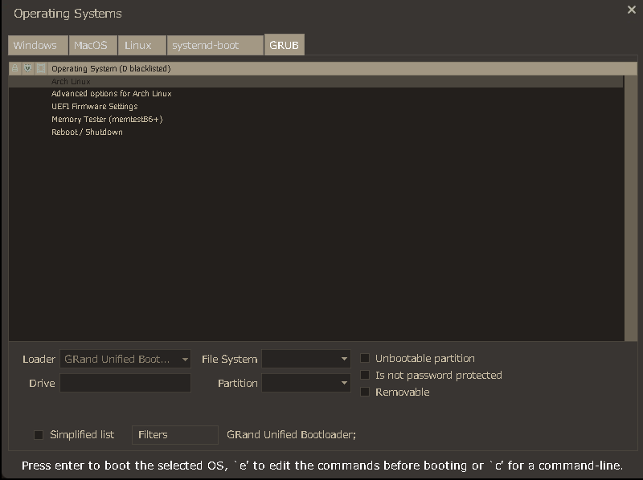

# Server Browser Grub Themes
A collection of GRUB themes themed around Valve's server browser.

> [!WARNING]
> As the project is currently in alpha, the implementation is currently poor. It strictly only supports the `1920x1080` resolution, although close resolutions are also possible. Resolution support can be confirmed by using `videoinfo` in the GRUB command shell.
>
> If supported, use `GRUB_GFXMODE=1920x1080x32` to set your resolution. Please see the [GNU GRUB manual's section on configuration setup and generation](https://www.gnu.org/software/grub/manual/grub/html_node/Simple-configuration.html) for more information. If unsupported, the only current theme will still work, but will scale much worse than intended.

> [!NOTE]
> Because of the nature of having multiple server browser themes, this will be a gradual project, developed over time with additional variations with different Valve games and features in mind. There may be issues, but none will be severe.
>
> Better previews and theme improvements are in the works before working on any newer themes.

| Fullscreen (Team Fortress 2 Colour Scheme) |
| ------------- |
| |

| Steam  | Steam (Pre-CEF) |
| ------------- | ------------- |
| Coming soon!  | Coming soon!  |

| Team Fortress 2  | Team Fortress 2 (Simplified View) |
| ------------- | ------------- |
| Coming soon!  | Coming soon!  |

| Left 4 Dead  | Left 4 Dead 2 |
| ------------- | ------------- |
| Coming soon!  | Coming soon!  |

| Half Life Deathmatch  | Half Life 2 Deathmatch |
| ------------- | ------------- |
| Coming soon!  | Coming soon!  |

## Installation 
### Automatic Setup (Coming Soon)
Automatic setup is a bit of a stretch right now, and is going to be done when there is more to actually set up and configure from a specific theme. This one is also in the works.
